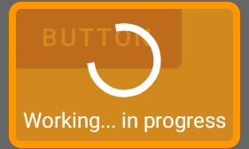

## Simple Progress Dialog Android
Here is super easy and extremely customizable android progress dialog. The best feature of this simple progress dialog over internal android dialog is to change properties dinamically.


**Custom Example:**<br/>


**Default Example:**<br/>


### Include in:
Android 4.+ (settings.gradle)
```
allprojects {
	repositories {
	maven { url 'https://jitpack.io' }
	}
}
```
### Dependency

```
dependencies {
        implementation 'com.github.farimarwat:SimpleProgressDialog:1.1' 
	}
```

### Usage:
```
class MainActivity : AppCompatActivity() {
    lateinit var mContext:Context
    val binding by lazy {
        ActivityMainBinding.inflate(layoutInflater)
    }
    lateinit var mDialog:SimpleProgressDialog
    override fun onCreate(savedInstanceState: Bundle?) {
        super.onCreate(savedInstanceState)
        setContentView(binding.root)
        mContext =  this
        mDialog = SimpleProgressDialog.Builder(mContext)
            .setMessage("Working... in progress")
			.setBackgroundDrawable(
                ContextCompat.getDrawable(mContext,R.drawable.background)
            )
            .build()
        binding.button.setOnClickListener {
            mDialog.show()
        }
        binding.button2.setOnClickListener {
            mDialog.hide()
        }
    }
}
```

### Methods:
**Setting Dialog Text:**

``
setMessage("Hello World")
``

**Setting Progress Color:**

``
setProgressColor(Color.RED)
``

**Setting Text Color:**

``
setTextColor(Color.GREEN)
``

**Setting Custom Background:**

```
.setBackgroundDrawable(
       ContextCompat.getDrawable(mContext,R.drawable.background)
 )
```
## Programatically Changable Properties
``
setBackgroundDrawable(background:Drawable?)
``

``
setProgressBarColor(color:Int)
``

``
setMessage(msg:String)
``

## Custom Background Template
background.xml (in drawable)
```
<?xml version="1.0" encoding="utf-8"?>
<selector xmlns:tools="http://schemas.android.com/tools"
    xmlns:android="http://schemas.android.com/apk/res/android">
    <item>
        <shape android:shape="rectangle">
            <corners android:radius="5dp"/>
            <stroke android:color="#FF9800" android:width="4dp"
                 />
            <solid android:color="#B3FF9800"
                 />
        </shape>
    </item>
</selector>
```
